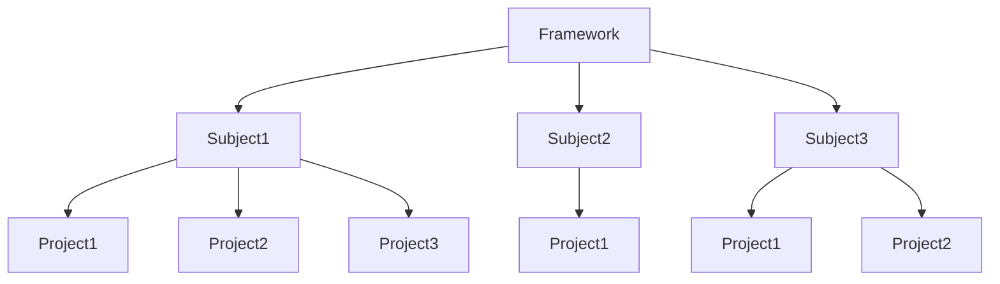

<!--  -->

<!-- HTML Formatting -->
<h1 align="center">
    
</h1>

<p align="center">
    <i style="font-size:20px">HerpTest - The Python Instructional Test Suite System</i>
</p>

<p align="center">
    <i>A test suite built to facilitate testing student programs for teachers</i>
</p>

<p align="center">
    <a href="https://github.com/RobertKilkenny/herptest_UFSA23/blob/master/LICENSE">
        
    </a>
    <a href="https://github.com/RobertKilkenny/herptest_UFSA23.git">
        
    <a>
</p>

<!-- ## <TAGLINE> -->

<!-- Static Badge -->
<!--
[](https://github.com/RobertKilkenny/herptest_UFSA23/blob/master/LICENSE)
-->

<!-- Dynamic Badge(s)
[](https://github.com/RobertKilkenny/herptest_UFSA23/blob/master/LICENSE)
[](https://github.com/RobertKilkenny/herptest_UFSA23.git)
-->

# Table of Content
- [Installation](#installation)
- [Getting Started](#getting-started)
- [Project Structure](#project-structure)
    - [HerpTest Toolbox (herptest.toolbox)](#herptest-toolbox-herptesttoolbox)
    - [Extracting LMS Archives (elma)](#extracting-lms-archives-elma)
    - [Running Unit Test Suite (herp)](#running-unit-test-suite-herp)
- [Under the Hood](#under-the-hood)
    - [Config Class](#config-class)
    - [Test Set Class](#test-set-class)
- [License](#license)
- [Credits](#credits)

<br></br>

# Installation
```bash
# Clone the repository
git clone https://github.com/RobertKilkenny/herptest_UFSA23.git

# Change to the project directory
cd herptest_UFSA23

# Build the python module
python3 setup.py sdist bdist_wheel

# Install the module with pip
pip install dist/herptest-<version>.tar.gz

# Confirm installation
herp -V
```

> **Note:**
> `"<version>"` is a number in the format `[0.#.#.##]`

> **ATTN:**
> It is suggested to create a python `venv` before installing the module
<!-- >> `"<version>"` is a number in the format `[0.MAJOR.MINOR.PATCH]` -->
<br></br>

# Getting Started
Type `'herp'` in the `root` directory of the below file structure via the terminal

```bash
.
├── Projects
│   ├── Empty
│   │   └── Program.py
│   ├── Solution
│   │   └── Program.py
│   └── <student>
│       └── Program.py
├── Settings
│   ├── __pycache__
│   │   ├── config.cpython-310.pyc
│   │   ├── config.cpython-38.pyc
│   │   ├── project.cpython-38.pyc
│   │   ├── tests.cpython-310.pyc
│   │   └── tests.cpython-38.pyc
│   ├── config.py
│   └── tests.py
└── Source
    ├── Framework
    │   └── Program.py
    └── Subject
```
> **Note:**
> `"<student>"` is the folder for the student that will be submitting. (there may be multiple)

<br></br>

# Project Structure
This package includes three primary tools:

- `herptest.toolbox`: Standardized / Cross-platform function calls.
> (Currently only library loading)
- `elma`: (E)xtract (LM)S (A)rchive - A command line tool to extract student submissions.
> (Support is limited to Canvas)
- `herp`: A command line tool to run a project test suite as specified by the user.

<br></br>

## HerpTest Toolbox (`herptest.toolbox`)

The toolbox includes the following helper functions, intended to be cross-platform:

`loadTempLibrary(directory, name)`
Returns library loaded with temporary filename; this is necessary on some systems to avoid name collisions.

`loadLibrary(directory, name)`
Returned regularly loaded library

`unloadLibrary(library)`
Unloads the library passed as a parameter

`findLibrary(directory, name)`
Attempts to find any valid version of the library, name-wise (lib, so, etc)

`loadModule(filename)`
Loads a Python module from the supplied filename and returns it.

<br></br>

## Extracting LMS Archives (`elma`)
The `elma` tool will extract a mass-download archive file from LMS systems (such as Canvas) to a submissions directory,
accounting for common renaming schemes and potential student name collisions.

```
usage: elma [-h] [-z] filename destination

Unzips submissions from LMS. Defaults to Canvas format.

positional arguments:
  filename       submissions zip file
  destination    where to extract submissions to

options:
  -h, --help     show this help message and exit
  -z, --zybooks  process ZyBooks archive (default: False)
```

<br></br>

## Running Unit Test Suite (`herp`)

The `herp` command will begin the running of unit tests of all target project. It can take the following arguments:
```
usage: herp [-h] [-V] [-t] [-q] [-w] [-d] [-s SET] [suite_path] [target_path]

A program to run a set of tests for a programming assignment.

positional arguments:
  suite_path         path of test suite to load
  target_path        path of target projects (by subdirectory)

options:
  -h, --help         show this help message and exit
  -V, --version      show program's version number and exit
  -t, --threaded     use threads instead of processes
  -q, --quiet        execute in quiet mode (console)
  -w, --warn         display warning information (console)
  -d, --debug        capture debug information (logfile)
  -s SET, --set SET  test only projects designated (e.g., *_LATE*)
```

<br></br>

# Under the Hood

## Test Suite Topology
Upon startup, the `herp` utility will optionally initialize the framework specified in the settings. This framework is
only built and initialized once for all students; any items that must be rebuilt for each student should be handled on
an per-subject (student) basis. The herp utility provides a mechanism to initialize and clean up at the framework,
subject, and project level (where there is one framework used to test many subjects, and each subject has one or more
projects that are tested individually.)


<br></br>
## Config Class

The test suite is identified by a `config.py` file that is loaded as a module. The config file must provide--at minimum--the following function:

  ```python
  def get_suite_config(runtime: argparse.Namspace) -> herptest.Config
  ```

The Config class is defined as follows:

```python
__init__(self, runtime=None: argparse.Namespace, test_sets=None: tuple(herptest.TestSet, ...), **keywords)
```

    Named Arguments
    ---------------
    runtime:   arguments passed at runtime
    test_sets: tuple of TestSet objects defining the set of tests for subsections of the target
    
    Keyword Arguments
    -----------------  
    result_path:  Directory where results of tests should be stored. Defaults to "Results".
    result_file:  CSV file name for storing test results (one per subject). Defaults to "result.csv".
    error_log:    Error log file name (one per subject and overall). Defaults to "error.log".
    summary_file: CSV file name for storing summary of subject tests results. Defaults to "summary.csv".

    Any other key-value pairs will be added directlu to the object as attributes (for custom data elements).

The Config class includes a key-value store for build parameters (self.build). The keys can be accessed as attributes
(e.g., build.foo = "bar"). All keys default to the Python "None" value. The pre-determined keys are as follows:

```
  base:          location of any base code to be copied into subject destination folder before the subject code
  destination:   location where base, then subject, files should be copied in preparation fo building
  
  framework_src: location of framework source to be built
  framework_bin: location where framework code should be built (e.g., where object / executable files go when compiled)

  subject_src:   location of subject source to be built (often the same as "destinaton")
  subject_bin:   location where subject code should be built (e.g., where object / executable files go when compiled)

  prep_cmd:      one, or a sequence of, command(s) to be executed in preparation for compile (beforehand).
  compile_cmd:   one, or a sequence of, command(s) to be executed as part of the compilation process.
  post_cmd:      one, or a sequence of, command(s) to be executed after the compilation has been completed (afterward).

```

  Each command is a sequence (e.g., list) constructed as follows:

```
  (execution_command, *parameters)

The following optional methods in Config may be overloaded:

  initialize_framework(self) -> framework_context
  Called after building the framework. It should return any framework_context that is important to properly shutdown /
  cleanup the framework. By default, executes no instructions but returns "None".

  shutdown_framework(self, framework_context)
  Clean up / shutdown the framework. This method will be called when all testing is done. The context passed in is
  identical to that returned by the initialize_framework method. Default implementation is no-op.

  initialize_subject(self, subject_bin, framework_context) -> subject_context
  Called after subject project(s) are built but before testing. In addition to the framework context, it is passed the
  subject output (binary) directory. It should return any subject_context important to properly shutdown / cleanup once
  all of the subject's project tests have been completed. By default, executes no instructions but returns subject_bin.

  shutdown_subject(self, subject_context)
  Clean up / shutdown the testing subject. This method is called when testing is done for subject. The subject_context
  passed in is identical to that returned by the initialize_subject method. Default implementation is no-op.

  initialize_test_set(self, test_set, subject_context, framework_context) -> test_set_context
  Called by test suite to prepare a set of tests to be run on this subject. In addition to other contexts, the current
  TestSet object (test_set) is passed to the call. It should return any test_set_context that is important to properly
  shutdown / cleanup the test set after testing is completed. By default, executes no instructions but returns test_set.
  
  shutdown_test_set(self, test_set_context)
  Clean up / shutdown the test set for the current subject. This method is called when test set is done for subject. The
  test_set_context passed in is identical to that returned by initialize_test_set. Default implementation is no-op.
```

## Test Set Class

The TestSet class is defined as follows:

```
  __init__(self, name: str, id: str, num_tests: int | Callable, test_function: Callable, **keywords)
```
    Required Arguments
    ------------------
    name:          plain-language name for the test set for visual display
    id:            shorthand string for test set (ASCII only, alpha-numerics and/or underscores - e.g., [A-Ba-b0-9_]*)
    num_tests:     the number of tests as an integer or a callable that returns the number of tests as an integer.
    test_function: a callable that returns a value of 0-1 to score the subject on the given test.
    
    The test_function parameter should act as a function with the following signature:
      test_function(test_num, test_set_context, subject_context, framework_context, config) -> float, ValueRange(0, 1)

    Keyword Arguments
    -----------------
    max_score:   Maximum score for this test set. Defaults to 100.0
    max_penalty: Maximum penalty that can be applied to the project. Defaults to 0.0
    test_desc:   Callable: test_desc(teset_num, *args, **keywords) -> description: str. Defaults to "Test #{test_num}"

TestSet has the following methods:

```
  add_case_penalty(self, name: str, fraction: float, function: Callable)
  Adds a case-test penalty (run once per test case) evaluation (empty by default).

  add_set_penalty(self, name: str, fraction: float, function: Callable)
  Adds a test set penalty (run once per test set) evaluation (empty by default)

  Penalty functions have the following signature:
    case_penalty(pen_num, test_num, test_set_context, subject_context, framework_context, config) -> float (max of 1)
    set_penalty(pen_num, test_set_context, subject_context, framework_context, config) -> float (max of 1)
```

TestSet has the following properties:
```

  name:           name of TestSet (readonly)
  id:             id of TestSet (readonly)
  num_tests:      number of tests in test set (readonly)
  max_score:      maximum overall score of test set (readonly)
  case_penalties: case-test penalties as a list of tuples (name, fraction, function) (readonly)
  set_penalties:  test-set penalties as a list of tuples (name, fraction, function) (readonly)
  max_penalty:    maximum overall penalty that can be applied to the score (readonly)
```
  
Called after building the framework. It should return any framework_context that is important to properly shutdown /--


<br></br>

<!-- 
# Contribution Instructions
# Contribution Expectations
# Known Issues
-->

# License

HerpTest is licensed under the terms of the GPL Open Source license and is available for free.

<br></br>

# Credits
```
Team Suite Life - CIS 4930 - Python Term Project
- Jack
- Robert
- Lunafreya Nyugen
- Renee Kaynor

Prior Contributors (pengtest Team)
- Tyler Maiello
- Emma Andrews
- Matthew Baumaister
- Matthew McDermott
- Gerard Avecilla
```
